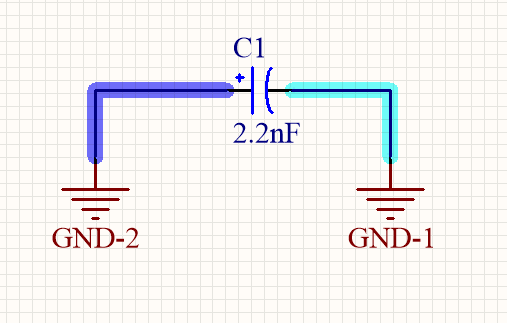
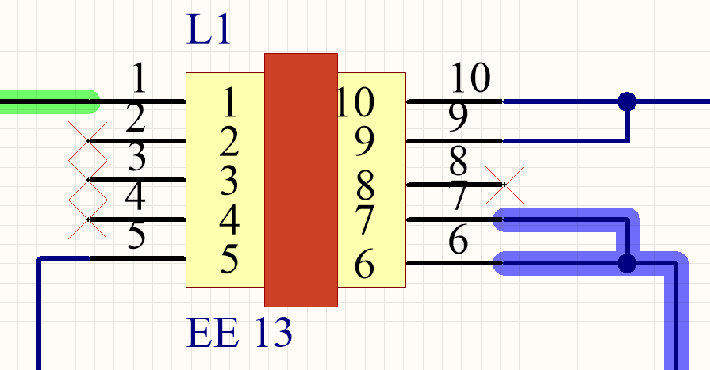
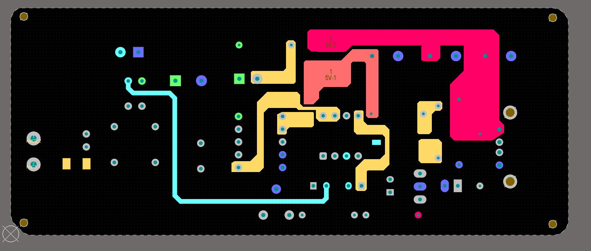
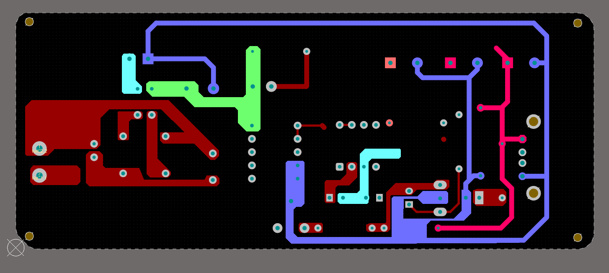
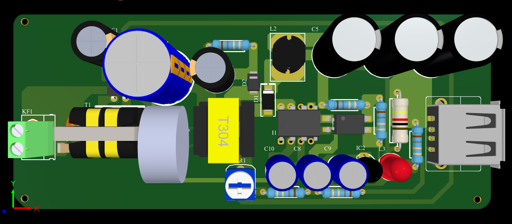

# D22-NguyenDucCanh - Nhật ký công việc

## A. Công việc đã làm

### 1. Sửa đổi nguyên lý nguồn Flyback 

- Thay đổi nguồn MASS (GND) của tụ C1 và C2

- Thay đổi biến áp nguồn xung EE 20 - 10 - 6 thành EE 13 do EE 20 không bán trên thị trường VN

### 2. Layout version 2 dự kiến sẽ đặt PCB

Mô tả: PCB layout 2 lớp (1 lớp bottom và 1 lớp top) đã sắp xếp lại linh kiện so với version 1

- Lớp TOP:

- Lớp BOT:

- 3D PCB

### 3. Project

- Link project: https://github.com/Tu-hai-long-vuong/D22-NguyenDucCanh/tree/main/250228/PCB_DO_AN_MACH_DIEN_TU

---

## B. Công việc sắp tới

- Đặt linh kiện về làm mạch lắc tay test thử nghiệm báo cáo lại trong tuần sau

- Chuyển sang code bài tập lớn VXL và lên nguyên lý cho mạch